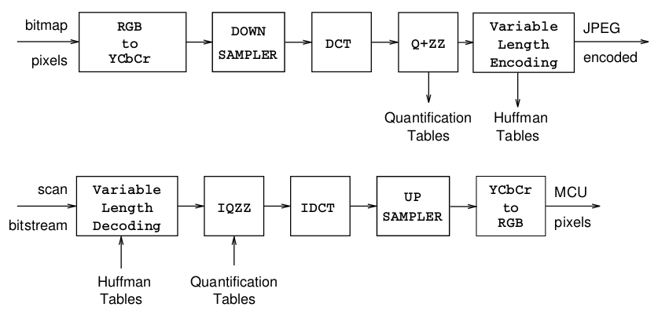
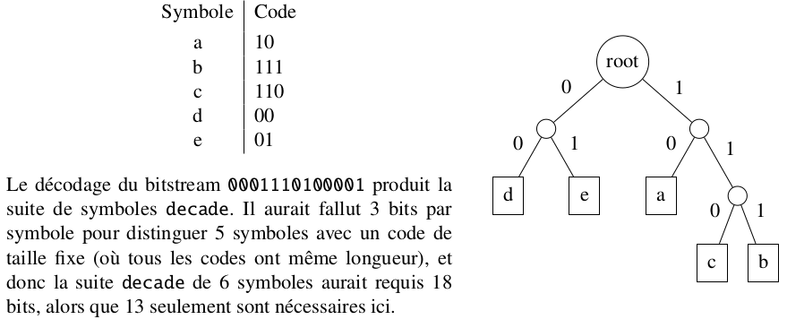
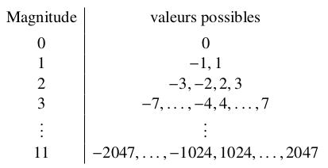
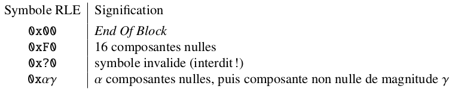
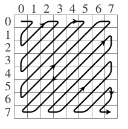
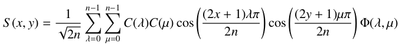
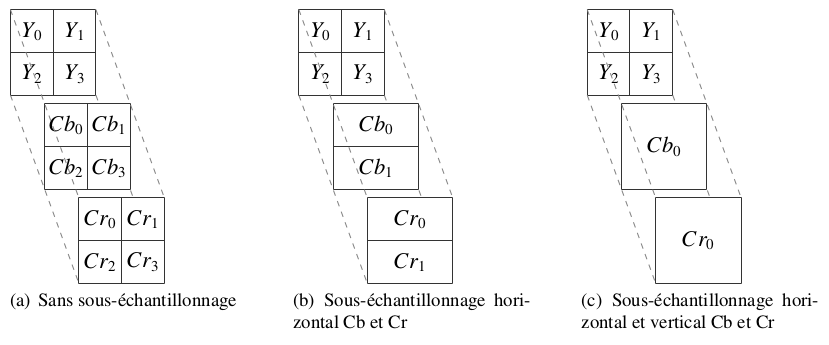

## Les différentes étapes

## Lecture et analyse du flux

On reçoit en entrée un *bitstream* (flux d'octets) qui correspond à l'image à traiter. Dans ce flux, on retrouve des *marqueurs* qui identifient ce que les données représentent. Un marqueur et ses données associées forment une *section*.

Deux types de sections :

* **Définition de l'environnement** : contient les données pour initialiser le décodage du flux (taille de l'image, tables de Huffman utilisées...).
* **Représentation de l'image** : données brutes qui contiennent l'image encodée.

Dans la norme JFIF, on distingue plusieurs types de marqueurs, par exemple :

* **SOI** : Start Of Image, représente le début du fichier et n'apparaît qu'une fois
* **SOF** : Start of Frame, début de l'image effectivement encodée. Le marqueur est associé à un nuémro qui permet de repérer le type d'encodage utilisé (dans notre cas, ce sera toujours **SOF0**). La section contient en particulier la taille de l'image et les facteurs de sous-éhcnatillonnage utilisés. Plusieurs frames peuvent être contenues dans un fichier (dans notre cas, il y en aura en général une seule).
* **SOS** : Start Of Scan, indique le début des données brutes de l'image encodée. Il y en a autant que de marqueurs SOF.
* **EOI** : End Of Image, marque la fin du fichier et n'apparaît qu'une fois.

## Décompression d'un bloc fréquentiel

Trois codages nous intéresse pour la décompression.

### Le codage de Huffman

**Principe** :

* Plus un symbole est utilisé, plus son code est petit
* Le code est préfixé : aucun code de symbole n'est le préfixe d'un autre symbole. Il n'y a donc pas d'ambiguïté et il est inutile d'utiliser des séparateurs entre les symboles.

**Construction** :
Un code de Huffman peut se représenter en utilisant un arbre binaire. Les feuilles de l'arbre correspondent aux symboles et chaque nœud correspond à un bit du code (gauche = '0', droite = '1'). Exemple :

Quelques remarques :

* Les feuilles de l'arbre représentent un code de longueur "profondeur de la feuille".
* La recherche du symbole associé à un code est facilité (parcours d'arbre jusqu'à une feuille)

Dans notre cas (JPEG), les tables de codage sout fournies avec l'image. La norme utilise plusieurs arbres pour compresser efficacement l'image. Pour chaque composante **DC** (couleur moyenne d'un bloc calculée par différence par rapport au bloc précédent) et **AC** (couleur d'un pixel calculé par différence par rapport au bloc dans lequel il se trouve), on a :
* **Une table** pour la luminance Y
* **Une table commune** pour les deux chrominances Cb et Cr

Le décodeur supporte donc **quatre tables** au total. Chaque table est caractérisée par un indice et par son type (AC ou DC), donnés lors de la définition des tables par le marqueur **DHT**. La correspondance indice/composante (Y, Cb, Cr) est donnée au début.

Le format JPEG fournit les tables de Huffman sous une forme particulière en deux temps :

1. On donne le nombre de codes de chaque longueur comprise entre 1 et 16 bits
2. On donne les **valeurs triées** dans l'ordre des codes.

On fonctionne donc profondeur par profondeur pour reconstruire la table. Il y a $n_p < 2^p - 1$ codes de longueurs *p* = 1,...,16.

### DPCM, magnitude et arbre DC

La composante DC d'un bloc est calculée par différence par rapport au bloc précédent (dit **prédicateur**). Pour la premier bloc, le prédicateur est initialisé à 0.

On classe les valeurs par odre de magnitude :

On codera une valeur dans une classe *m* par son indice codé sur *m* bits. Par exemple, -3 est le premier élément de la classe 2, on le codera donc par 00. De même, 7 est le dernier élément de la classe 3, on le codera par 111. Pour coder une valeur de magnitude *m*, il faut donc au maximum 4 + *m* bits.

Pour le décodage, il faut :

1. Décoder la magnitude à partir des bits lus dans le flux et de l'arbre DC
2. Lire les bits d'indices dans la classe de magnitude pour remonter, par différentielle, à la valeur DC.

### Arbres AC et codage RLE

Chacun des 63 coefficients AC non nul est codé par :

* Un symbole sur un octet : les 4 bits de poids fort indiquent le nombre de coefficients zéro qui précédent le coefficient actuel et les 4 bits de poids faible codent la classe de magnitude du coefficient (identique pour DC)
* Un nombre variable de bits

Deux symboles particuliers sont en plus utilisés :

* Code ZRL (0xF0) : saut de 16 composantes nulles.
* Code EOB (0x00) : signale que toutes les composantes AC restantes du bloc sont nulles.

Si un coefficient est non nul, le symbole RLE est suivi d'une séquence de bits correspondant à l'indice du coefficient dans sa classe de magnitude (le nombre de bits correspond à la magnitude du coefficient).

Pour le décodage, on étend les données compressées par lse algorithmes de Huffman et de RLE pour obtenir les données d'un bloc sous forme d'un vecteur de 64 entiers représentant les fréquences.

*Remarque* : une valeur 0xff à décoder doit toujours être suivi de la valeur 0x00. **Le 0x00 ne doit pas être interprété**.

## Quantification inverse et zig-zag inverse

### Quantification inverse

Au codage, on utilise deux **tables de quantification**, une pour la luminance et une pour les deux chrominances. On divise terme à terme chaque bloc 8x8 par une matrice de quantification, elle aussi de taille 8x8. Les résultats sont **arrondis** et plusieurs coefficients sont **ramenés à 0** lorsqu'ils sont peu visibles par l'œil humain, c'est ce qui induite le plus de perte et permet de gagner le plus de place.

Au décodage, on fait l'inverse : on multiplie élément par élément le bloc fréquentiel par la table de quantification.

### Zig-zag inverse

On reçoit un entrée un vecteur de 64 coefficients. L'objectif est de le réorganiser par une opération zig-zag inverse qui recopie les 64 coefficients aux coordonnées comme présentées dans la figure suivante :

**En conclusion :**

1. Multiplication des coefficients du bloc par ceux de la matrice de quantification lue
2. Effectuer la réorganisation zig-zag inverse

## Transformée en cosinus discrète inverse (iDCT)

Pour transformer les informations fréquentiellse en informations spatiales, on utilise la formule de la transformée en cosinus discrète inverse :

* $S$ : bloc spatial
* $\Phi$ : bloc fréquentiel
* $x, y$ : coordonnées des pixels dans le domaine spatial
* $\lambda, \mu$ : coordonnées des fréquences dans le domaine fréquentiel
* $C(x)$ : $\frac{1}{\sqrt{2}}$ si $x = 0$, $1$ sinon
* $n$ : taille du bloc, dans notre cas $n = 8$

**Le calcul avec la formule se fait avec des flottants. Les valeurs sont converties en entier 8 bits non-signés seulement après.**

## Reconstituion des MCUs

Le **sous-échantillonnage** est un etechnique de compression qui consiste en un ediminution du nombre de valeurs, appelées échantillons, pour certaines composantes de l'image.

On utilise la notation $h_1 \times v_1, h_2 \times v_2, h_3 \times v_3$ où $h_i$ et $v_i$ représentent le nombre de blocs horizontaux et verticaux pour la composante $i$. **On ne sous-échantillonne jamais la composante de luminance Y, son facteur d'échantillonnage donne donc les dimensions de la MCU en nombre de blocs.**

Il existe plusieurs types de sous-échantillonnages. Le décodeur devra supporter au moins les trois suivants, mais idéalement devra gérer tous les cas :

* **Pas de sous-échantillonnage** : nombre de blocs identique pour toutes les composantes. On se retrouve avec des facteurs de la forme $h_1 \times v_1, h_1 \times v_1, h_1 \times v_1$ (même nombre de blocs répétés pour toutes les composantes).
* **Sous-échantillonnage horizontal** : la composante sous-échantillonnée comprend deux fois moins de blocs en horizontal que la composante Y. Le nombre de blocs en vertical reste le même pour les trois composantes.
* **Sous-échantillonnage horizontal et vertical** : la composante sous-échantillonnée comprend deux fois moins de blocs en horizontal et en vertical qu ela composante Y.

On utilise la notation **L:H:V** pour caractériser le sous-échantillonnage. Par exemple :

* **4:4:4** Pas de sous-échantillonnage
* **4:2:2** Sous-échantillonnage horizontal ou vertical de Cb et Cr
* **4:2:0** Sous-échantillonnage horizontal et vertical de Cb et Cr

## Ordre de lecture des blocs

**Au codage** :

* Les MCUs sont balayées de **gauche à droite**, de **haut en bas**. Le taille des MCUs est donnée par les facteurs d'échantillonnage de la composante Y.
* L'ordonnancement des blocs dans le flux suit **toujours la même séquence**. Par exemple, ce sera toujours Y, puis Cb puis Cr, mais l'ordre peut être différent suivant les images. L'ordre est indiqué dans l'entête des sections SOFx et SOS.
* Lorsqu'une composante de MCU comprend plusieurs blocs, ils sont ordonnés de **gauche à droite**, de **haut en bas**.

**Au décodage** :

Il faut sur-échantillonner les blocs Cb et Cr pour qu'ils recouvrent la MCU en totalité. Dans le cas d'un sous-échantillonnage horizontal par exemple, la moitié gauche de chaque bloc de chrominance couvre le premier bloc $Y_0$ alors que la moitié droite couvre le second bloc $Y_1$.

## Conversion vers des pixels RGB

La conversion YCbCr vers RGB s'effectue pixel par pixel des trois composantes de la MCU reconstituée. Pour chaque pixel dans l'espace YCbCr, on obtient le pixel RBG par :

* $R = Y - 0.0009267 \times (C_b - 128) + 1.4016868 \times (C_r - 128)$
* $G = Y - 0.3436954 \times (C_b - 128) - 0.7141690 \times (C_r - 128)$
* $B = Y + 1.7721604 \times (C_b - 128) + 0.0009902 \times (C_r - 128)$

Les valeurs devront être entières et clampées entre 0 et 255.

## Des MCUs à l'image

La taille de l'image n'est pas forcément un multiple de la taille des MCUs, le découpage en MCUs peut déborder à droite et à gauche. Au codage, les MCUs sont complétés en dupliquant la dernière colonne/ligne contenue dans l'image dans les colonnes/lignes en trop. Au décodage, il faut donc **tronquer celles à droite et en bas de l'image** selon le nombre exact de pixels.

## Format de sortie PPM

Une fois décodées, les images sont enregistrées au format PPM. Le format est le suivant :

P6  
\<largeur en pixels\> \<hauteur en pixels\>  
255  
\<données en binaire : trois octets pour R, G, B pour chaque pixel\>