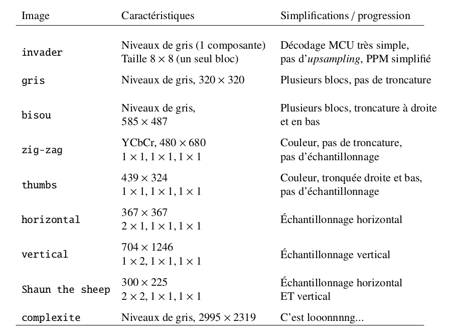

Mettre une croix [x] lorsque la tâche est développée et testée.

## Lecture et analyse du flux

[] Extraction de l’entête JPEG, récupération de la taille de l’image, des facteurs d’échantillonnage et des tables de quantification et de Huffman  

## Découpage de chaque CMU

### Reconstruction de chaque bloc

[] Extraction et décompression  
[] Quantification inverse (multiplication par les tables de quantification)  
[] Réorganisation zig-zag  
[] Calcul de la transformée en cosinus discrète inverse (iDCT)  

## Upsampling

[] Mise à l’échelle des composantes Cb et Cr en cas de sous-échantillonnage  

## Reconstruction des pixels

[] Conversion YCbCr vers RGB  

## Passage à l'image

[] Écriture du résultat dans le fichier PPM

## Tests

